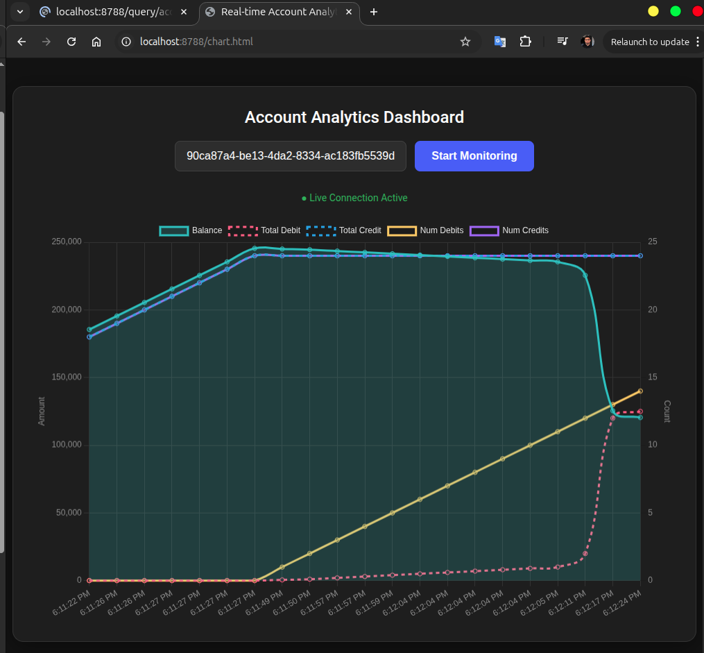
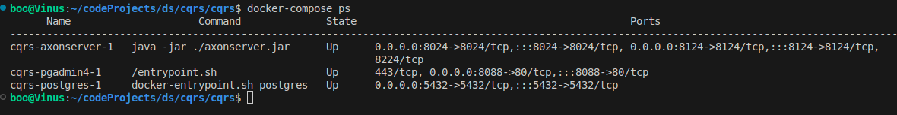
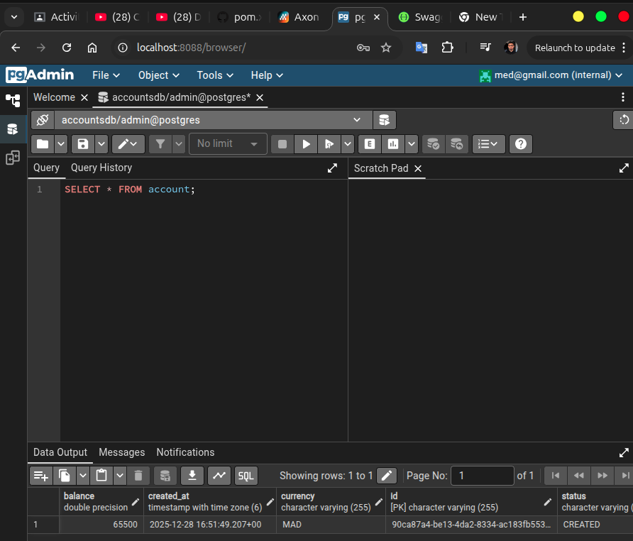

# Axon CQRS & Event Sourcing – Homework Project

This project demonstrates **CQRS and Event Sourcing** using **Axon Framework** with two microservices:

- **Account Service** – handles commands (create account, debit, credit)
- **Analytics Service** – consumes events and exposes real-time account state using reactive streams (Flux)

Axon Server is used for event storage and messaging, and PostgreSQL is used for persistence.

---

## Architecture Overview

- **Axon Server** (Docker)
- **Account Microservice**
  - Command side
  - REST API (Swagger)
- **Analytics Microservice**
  - Query side
  - Real-time balance updates using Flux
- **PostgreSQL**
- **Reactive Dashboard**

---

## Services

### Account Microservice
- Create account
- Debit account
- Credit account
- Publishes domain events to Axon Server

Swagger UI is available to test the endpoints.

---

### Analytics Microservice
- Subscribes to account events
- Builds read models
- Exposes real-time account balance changes using **Flux**
- Displays live analytics dashboard

---

## Real-Time Analytics

The analytics service reflects account balance changes in real time as events are processed.

---

## Infrastructure

Axon Server and PostgreSQL are running via Docker Compose.

Database state can be inspected using pgAdmin.

---

## Key Concepts 

- CQRS (Command Query Responsibility Segregation)
- Event Sourcing
- Axon Framework & Axon Server
- Reactive Streams (Flux)
- Microservices communication via events
- Real-time analytics dashboard

---
